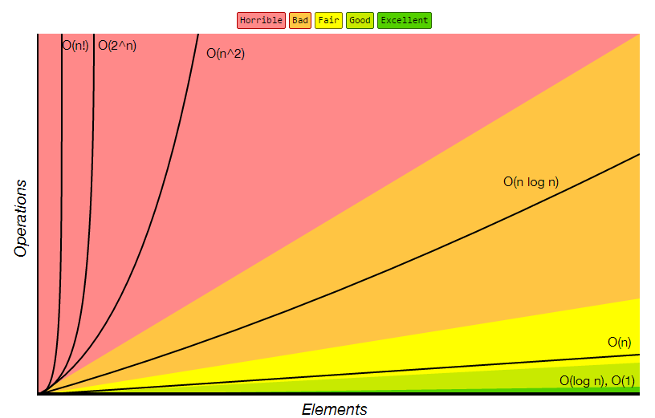

# 챕터1: 자료구조와 알고리즘의 이해

> 프로그램이란 데이터를 표현하고, 그렇게 표현된 데이터를 처리하는 것이다.

데이터 표현은 데이터 저장을 포함하는 개념이다.

자료구조란 컴퓨터 과학에서 효율적인 접근 및 수정을 가능케 하는 자료의 조직, 관리, 저장을 의미한다. 더 정확히 말해, 자료구조는 데이터 값의 모임, 또 데이터 간의 관계, 그리고 데이터에 적용할 수 있는 함수나 명령을 의미한다. 신중히 선택한 자료구조는 보다 효율적인 알고리즘을 사용 할 수 있게 한다.(위키백과)

자료구조 분류는 다음과 같다.

1. 선형구조
    - 리스트
    - 스택
    - 큐

2. 비선형 구조
    - 트리
    - 그래프

3. 파일구조
    - 순차파일
    - 색인파일
    - 직접파일

4. 단순구조
    - 정수
    - 실수
    - 문자
    - 문자열


라이브러리를 잘 가져다 쓰려면 리스트가 무엇이고 트리가 무엇인지 알아야 한다. 그냥 아는 것이 아니라 각각의 특성을 정확히 이해해야 한다.

## 자료구조와 알고리즘

자료구조가 '데이터의 표현 및 저장방법'을 뜻한다면, 알고리즘은 표현 및 저장된 데이터를 대상으로 '문제의 해결 방법'을 뜻한다. 그래서 자료구조가 달라지면 문제해결방식도 달라지기 때문에, 알고리즘은 자료구조와 연관이 많다.

배열이라는 자료구조
```
int arr[10] = {1, 2, 3, 4, 5, 6, 7, 8, 9, 10};
```

배열에 저장된 모든 값의 합을 구하는 알고리즘
```
for(idx=0 idx<10; idx++)
  sum += arr[idx];
```


## 시간 복잡도와 공간 복잡도

그저 잘 작동하는 자료구조와 알고리즘을 찾는 것이 목적이라면 기능별로 자료구조와 알고리즘을 하나씩만 알아도 된다. 하지만 우리는 잘 작동하는 것은 물론이거나와 좋은 성능까지 보장받기를 원한다. 때문에 우리는 자료구조와 알고리즘을 분석하고 평가할 수 있어야 한다.

시간 복잡도(Time Complexity)는 이 알고리즘이 문제를 해결하는데 걸리는 시간을 말한다. 공간 복잡도(Space Complexity)는 이 알고리즘이 문제를 해결하는데 사용하는 메모리를 말한다. 보통은 메모리 사용량보다 속도를 중요하게 생각하기 때문에 시간 복잡도를 기준으로 많이 사용한다.

어떻게 **시간 복잡도**를 잴 것인가? 시간을 잴 수 있어도 큼 의미를 부여하기 어렵다. 처리해야 할 데이터양의 변화에 따른 속도의 증가 및 감소의 정도도 얼아야 하는데, 이를 위해서 조건을 달리하여 수백 번, 수천 번 실행해가면서 시간을 잴 수는 없는 일이기 때문이다. 그래서 **연산의 횟수**를 통해서 알고리즘의 빠르기를 판단한다. 식을 구성하면 데이터 수의 증가에 따른 연산횟수의 변화 정도를 판단할 수 있다. 둘 이상의 알고리즘을 비교하기가 쉽다.

**연산의 횟수**를 어떻게 잴 것인가? 어떠한 연산을 적게 수행하는 알고리즘이 좋은 알고리즘이겠는가? **탐색 알고리즘일 때는 동등비교를 하는 비교연산을 기준으로 한다.** 비교연산의 수행횟수가 줄어들면 < 연산과 ++ 연산의 수행횟수도 줄어들고, 비교연산의 수행횟수가 늘어나면 < 연산과 ++ 연산의 수행횟수도 늘어나기 때문이다. **다른 연산들은 == 연산에 의존적이다.**

모든 알고리즘에는 가장 행복한 경우와 가장 우울한 경우가 각각 존재하며, 이를 전문용어로 '최선의 경우(best case)'그리고 '최악의 경우(worst case)'라고 한다. 알고리즘 평가하는데 '최선의 경우'는 관심대상이 아니다. 어떠한 알고리즘이건 간에 최선의 경우는 대부분 만족할만한 결과를 보이기 때문이다. 그리고 '평균의 경우(average case)'를 생각할 수도 있을텐데, 평균의 경우는 시간 복잡도를 평가하는 정보로 의미리를 지닌다. 하지만 이를 계산하는 것은 쉽지 않다. 평균 정의를 하기 힘들기 때문이다.


## 연산 횟수 함수 T(n)

시간복잡도는 연산횟수 함수를 통해 측정한다. 데이터의 수 n에 대한 T(n) 연산횟수 함수를 만들어서 시간복잡도를 나타낸다. 연산횟수 함수 T(n)을 구해보자. 탐색 알고리즘에서는 `==` 동등 연사자의 수가 연산 횟수로 여긴다. 이 비교연산횟수는 Best Case와 Worst Case로 나뉘어진다. 보통 알고리즘을 평가하는데는 Worst Case을 기준으로 삼는다. 왜냐하면, Best Case는 어느 알고리즘이든 최고의 결과를 보여주기 때문에 차이를 가늠하기 힘들다. 평균 Case를 사용할 때는 평균값을 구하기가 힘들고 어느정도까지가 평균인지도 정하기도 어렵다. 즉 신뢰도가 낮다. 순차 탐색 알고리즘의 Worst Case 시간복잡도 `T(n) = n` 이다. 하지만 평균 case는 `T(n) = 3/4 * n` 이다. 구하는 과정도 복잡하다.


## 빅-오 표기법(Big-Oh Notation)

데이터 수의 증가에 따른 연산횟수의 증가 형태(패턴)을 나타내는 표기법. 성능 분석의 좋은 도구이다. 쉽게 설명을 하자면, 함수 T(n)에서 가장 영향력이 큰 부분이 어딘가를 따지는 것이다. T(n)이 다항식으로 표현이 된 경우, 최고차항의 차수가 빅-오가 된다. 예를 들면, `T(n)=n^2 + 2n + 9` 이면, `O(n^2)` 이다.


## 대표적인 빅-오

- `O(1)`: 상수형 빅-오. 데이터 수에 상관없이 연산횟수가 고정인 유형의 알고리즘. 
- `O(log n)`: 로그형 빅-오. 데이터 중가율에 비해서 연산횟수의 증가율이 훨신 낮은 알고리즘. 바람직한 유형.
- `O(n)`: 선형 빅-오. 데이터수와 연산횟수가 비례하는 알고리즘.
- `O(n log n)`: 선형 로그형 빅-오. 데이터 수가 두 배로 늘 때, 연산횟수는 두 배를 조금 넘게 증가하는 알고리즘.
- `O(n^2)`: 데이터의 수의 제곱에 해당하는 연산횟수를 요구하는 알고리즘. 데이터의 양이 많을 경우 적용시키기 부적절하다. 예를 들면, 이중으로 중첩된 반복문 내에서 알고리즘에 관련된 연산이 진행되는 경우
- `O(n^3)`: 데이터의 수의 세 제곱에 해당하는 연산횟수를 요구하는 알고리즘. 
- `O(2^n)`: 지수형 빅-오. 사용한다는 것 자체가 비현실적인 알고리즘. 지수적 증가는 매우 무서운 연산횟수의 증가를 보인다.




# 챕터2: 재귀(Recursion)
재귀는 자료구조와 알고리즘에 있어서 매주 중요한 요소이다. 자료구조에서는 재귀의 적용을 중심으로 공부.

Recursive 함수를 실행하는 중간에 다시 Recursive 함수가 호출되면, Recursive 함수의 복사본을 하나 더 만들어서 복사본을 실행하게 됩니다. 실제로 함수를 구성하는 명령문은 CPU로 이동이 되어서(복사가 되어서) 실행이 된다.

## 재귀함수의 디자인 사례
재귀함수는 자료구조나 알고리즘의 어려운 문제를 단순화하는데 사용되는 중요한 무기이다. 무엇보다도 재귀함수가 있기에 재귀적인 수학적 수식을 그대로 코드로 옮길 수 있다. 

### 팩토리얼을 알고리즘으로 디자인.

1. 수식화  
```
       --- n * f(n-1) ··· n >= 1
f(n)--|
       --- 1          ··· n = 0
```
f(0)에 해당하는 0!이 1이므로 이것이 재귀함수의 탈출조건이 된다.

2. 코드로 표현
`n * f(n-1)` 수식을 코드로 표현하면,
```
if(n > = 1){
    return n * Factorial(n-1);
}
```

`f(0) = 1` 수식을 코드로 표현하면,
```
if(n == 0){
    return 1;
}
```

최종적으로,

```
if(n == 0){
    return 1;
}else{
    return n * Factorial(n-1);
}
```

### 피보나치 수열
피보나치 수열은 재귀적은 형태를 띠는  대표적인 수열이다. 앞엣것 두 개 더해서 현재의 수를 만들어가는 수열이다.

1. 수식화
```
           -- 0                    ··· n = 1
fib(n)= --|-- 1                    ··· n = 2
           -- fib(n-1) + fib(n-2)  ··· otherwise
```

2. 코드로 표현
```
if(n = 1)
    return 0;
else if(n = 2)
    return 1;
else
    return Fibo(n-1) + Fibo(n-2);
```

보통 우리는 소스코드를 다음과 같은 형태로 분석한다. "이 함수가 호출이 되고, 그 다음에 저 함수가 호출이 되면서, 마지막으로 요 함수가 호출이 되네." 즉 함수의 호출순서가 파악이 되지 않으면 코드를 이해했다고 생각하지 않거나 찜찜해하는 경향이 있다. 그래서 위 예제와 같이 재귀적으로 정의된 함수의 호출 순서도 100% 완벽하게 나열하려고 노력하기도 한다. 하지만 이로 인해서 여러분의 혼란이 가중될 수 있으니 주의해야 한다.  
**우리는 피보나치 수열을 수식적으로 표현하였다.** 재귀함수에 익숙해지면 누구나 함수의 호출순서에 신경을 쓰지 않게 된다.


### 하노이 타워
하노이 타워 문제는 반복 패턴을 찾아내면 된다. A,B,C 위치가 주어졌을 때, A에 있는 원반들을 C로 옮기기 위해서는 위에서부터 원반들을 하나씩 다른 곳으로 옮긴 상태에서 맨 밑의 원반을 움직일 수 있다.
이 패턴은 다음과 같다.

1. 1번 원반을 A에서 C로 옮긴다.
2. 2번 원반을 A에서 B로 옮긴다.
3. 1번 원반을 C에서 A로 옮긴다.
4. 3번 원반을 A에서 C로 옮긴다.
5. 1번 원반을 B에서 A로 옮긴다.
6. 2번 원반을 B에서 C로 옮긴다.
7. 1번 원반을 A에서 C로 옮긴다.

이 작업을 패턴으로 옮긴다.

1. 제일 큰 원반을 제외한 작은 원반들을 A에서 B로 옮긴다.
2. 제일 큰 원반을 A에서 C로 옮긴다.
3. 작은 원반들을 B에서 C로 옮긴다.

수식으로 옮긴다.

1. n-1 개의 원반을 A에서 B로 옮긴다.
2. 제일 큰 원반을 A에서 C로 옮긴다.
3. n-1 개의 원반을 B에서 C로 옮긴다.

코드로 나타낸다
```C
// main.c
#include <stdio.h>
#include "hanoitop.h"

int main()
{
    move_circle(3, 'A', 'B', 'C');
    return 0;
}

```
```C
// hanoitop.h
void move_circle(int num, char from, char by, char to){
    if(num==1){
        printf("The %d circle moves from %c to %c \n", num, from, to);
    }else{
        move_circle(num-1, from, to, by);
        printf("The %d circle moves from %c to %c \n", num, from, to);
        move_circle(num-1, by, from, to);
    }
}
```
```text
The 1 circle moves from A to C
The 2 circle moves from A to B
The 1 circle moves from C to B
The 3 circle moves from A to C
The 1 circle moves from B to A
The 2 circle moves from B to C
The 1 circle moves from A to C
```

# 챕터3: 추상 자료형 Abstract Data Type

추상적 자료형은 컴퓨터 과학에서 자료들과 그 자료들에 대한 연산들을 명기한 것이다. 추상적 자료형은 구현 방법을 명시하고 있지 않다는 점에서 자료구조와 다르다. 비슷한 개념의 추상적 자료 구조는 각 연산의 시간 복잡도를 명기하고 있지만 추상적 자료형에서는 이것조차 명기하지 않는다. 추상적 자료형은 인터페이스와 구현을 분리하여 추상화 계층을 둔 것이다. - 위키 백과

구체적인 기능의 완성과정을 언급하지 않고, 순수하게 기능이 무엇인지를 나열한 것을 가리켜 '추상 자료형' 또는 간단한 ADT라 한다. 

>우리는 C언어의 파일 입출력을 공부하면서 FILE 구조체의 내부를 궁금해하지 않았다. FILE 구조체 내부를 몰라도 파일과 관련된 모든 연산을 처리할 수 있기 때문이다. 사실 FILE 구조체의 내부에 대한 궁금증은 불필요한 것이다.

>리스트 사용자에게 사용방법 이외의 불필요한 부분까지 알도록 부담주지 않는다.

잠깐 질문. [객체 지향 프로그래밍과 ADT 차이?](https://stackoverflow.com/questions/12982257/difference-between-abstract-data-type-and-object)


## 리스트
- 리스트는 구현 방법에 대해서 두 가지로 나뉜다. 배열로 기반으로 하는 `순차 리스트`와 메모리 동적 할당을 기반으로 구현한 `연결 리스트`이다.
- 리스트 자료구조는 데이터를 `나란히 저장한다`. 그리고 `중복된 데이터의 저장을 막지 않는다`.
- 데이터 순서 O, 중복 O

### 리스트 Abstract Data Type
```C
void ListInit(List * plist);
// - 초기화할 리스트의 주소 값을 인자로 전달한다.
// - 리스트 생성 후 제일 먼저 호출되어야 하는 함수이다.
void LInsert(List * plist, LData data);
// - 리스트에 데이터를 저장한다. 매개변수 data에 전달된 값을 저장한다.
int LFirst(List * plist, LData * pdata);
// - 첫번째 데이터가 pdata가 가리키는 메모리에 저장된다.
// - 데이터의 참조를 위한 초기화가 진행된다.
// - 참조 성공 시 TRUE(1), 실패 시 FALSE(0) 반환
int LNext(List * plist, LData * pdata);
// - 참조된 데이터의 다음 데이터가 pdata가 가르키는 메모리에 저장된다.
// - 순차적인 참조를 위해서 반복 호출이 가능하다.
// - 참조를 새로 시작하려면 먼저 LFirst 함수를 호출해야 한다.
// - 참조 성공 시 TRUE(1), 실패 시 FALSE(0) 반환
LData LRemove(List * plist);
// - LFirst 또는 LNext 함수의 마지막 반환 데이터를 삭제한다.
// - 삭제된 데이터는 반환된다.
// - 마짐가 반환 데이터를 삭제하므로 연이은 반복 호출을 허용하지 않는다.
int LCount(List * plist);
// - 리스트에 저장되어 있는 데이터 수를 반환한다.
```

## 리스트 구현체 비교
- 배열은 메모리 특성이 정적이어서 메모리의 길이를 변경하는 것이 불가능.
- LinkedList는 필요할 때마다 메모리를 할당하여 새로운 데이터를 추가 연결한다.
- ArrayList는 인덱스를 통해 데이터에 바로 접근할 수 있어 검색이 빠르다. 하지만 배열특성상 추가/삭제가 느리다.
- LinkedList는 노드를 차례로 검색해야 해서 검색이 느리다. 하지만 추가/삭제가 빠르다.
