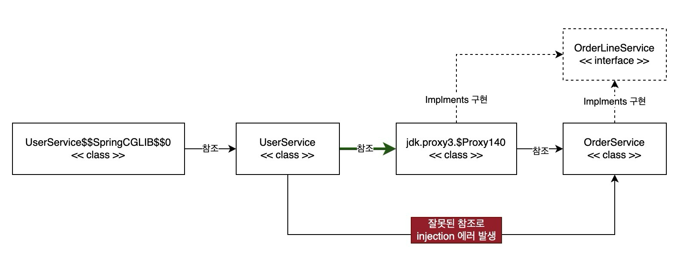

# 프록시 빈

프록시 빈이란 빈들 중에 프록시 역할을 하는 빈이다. 프록시 빈은 트랜잭션, async 등 전역으로 사용해야하는 기능을 쉽게 비즈니스 로직에 적용할 수 있다. 

프록시 빈을 생성하는 방식은 2가지가 있다. 대상 클래스의 인터페이스를 구현해서 하는 방식은 `JDK Dynamic Proxy` 이고 `proxy-target-class: false` 로 스프링에서 세팅한다. 대상 클래스를 상속하는 방식은 `CGLIB` 방식이고 `proxy-target-class: true` 로 세팅한다.  Spring 최신 버전 기본값은 `CGLIB` 방식으로 `proxy-target-class: true` 로 되어있다. 옛날 Spring 3.X 레거시 버전에선 인터페이스 기반 방식으로 `proxy-target-class: false`으로 되어 있다. 

참고로 `@Transactional`, `@Async` 와 같은 AOP 를 사용하는 클래스들 대상으로만 프록시빈을 생성한다. 그 외 빈들은 그냥 POJO 일반적인 객체 빈으로 Spring Container 에 등록된다.

인터페이스 기반 방식에서 주의해야할 점은 해당 빈을 인젝션해서 사용하는 클래스에서 해당 인터페이스 타입으로 필드를 선언해야한다. 인터페이스에 정의하지 않은 메서드들은 사용할 수 없다. Spring context 로딩 시, 해당 빈을 사용하는 클래스에 인터페이스 타입이 아닌 구현체 타입으로 선언하면 빈 생성 에러를 만나게 된다. 다만, 인터페이스를 사용하지 않은 클래스는 자동으로 CGLIB 방식으로 프록시 빈을 생성한다.



```yml
spring:
  aop:
    proxy-target-class: false # JDK DYNAMIC PROXY 인터페이스 기반.
```

```java
public interface OrderLineService {

  List<Object> getOrderLines(Long orderId);

}
```

```java
@Slf4j
@Service
public class OrderService implements OrderLineService {

  @Transactional
  public List<Object> getUserOrderList(Long userId) {
    log.info("{} > {}", this.getClass().getSimpleName(), "getUserOrderList");
    return List.of("ORDER1", "ORDER2");
  }

  @Transactional
  @Override
  public List<Object> getOrderLines(Long orderId) {
    log.info("{} > {}", this.getClass().getSimpleName(), "getOrderLines");
    return List.of(orderId, "LINE1", "LINE2");
  }
}
```

```java
@Slf4j
@Service
@RequiredArgsConstructor
public class UserService {

  // OrderService는 현재 OrderLineService 인터페이스를 구현하고 있음. 하지만 인젝션하는 타입 구현 클래스의 타입으로 함.
  // bean 프록시 생성 방식에 따라 인젝션이 되는지 안되는지 테스트
  private final OrderService orderService;

  @Transactional
  public boolean hasOrder(Long userId) {
    log.info("{} > {}", this.getClass().getSimpleName(), "hasOrder");
    List<Object> orders = orderService.getUserOrderList(userId);
    return !orders.isEmpty();
  }

}
```

```java
@ActiveProfiles("test")
@SpringBootTest
class UserServiceTest {

  @Autowired
  private UserService userService;

  @Test
  void test() {
  }

  @Test
  void existsUserOrderTest() {
    boolean isExists = userService.hasOrder(123L);
    Assertions.assertTrue(isExists);
  }
}
```

```
***************************
APPLICATION FAILED TO START
***************************

Description:

The bean 'orderService' could not be injected because it is a JDK dynamic proxy

The bean is of type 'jdk.proxy3.$Proxy140' and implements:
	org.chaeyun.order.OrderLineService
	org.springframework.aop.SpringProxy
	org.springframework.aop.framework.Advised
	org.springframework.core.DecoratingProxy

Expected a bean of type 'org.chaeyun.order.OrderService' which implements:
	org.chaeyun.order.OrderLineService


Action:

Consider injecting the bean as one of its interfaces or forcing the use of CGLib-based proxies by setting proxyTargetClass=true on @EnableAsync and/or @EnableCaching.

```

